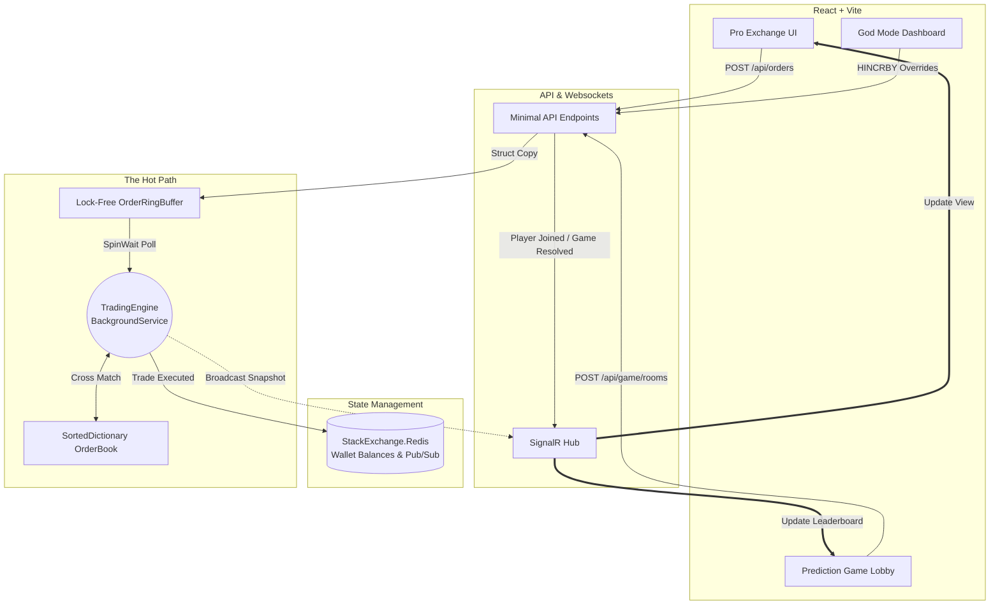
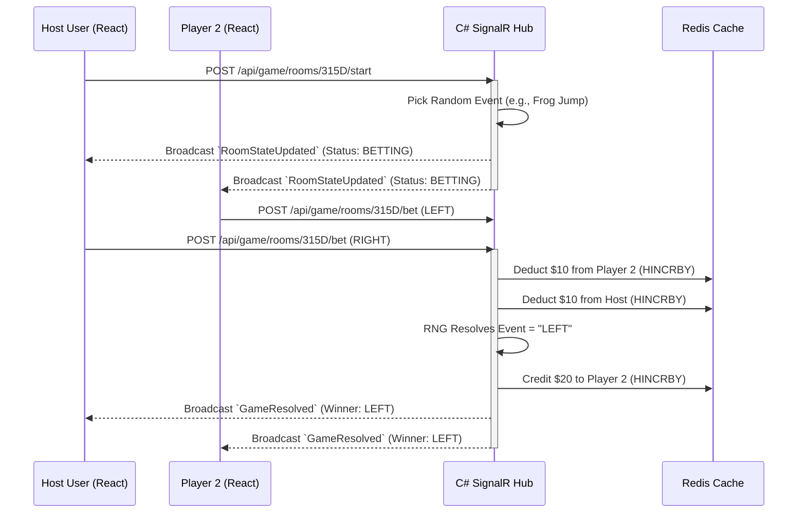

# Building an Ultra-Low Latency Trading Engine & Prediction Market: A Deep Dive

When I set out to build this trading engine, the goal wasn't just to create another CRUD application backed by a SQL database. I wanted to design a system that bridges the gap between **sub-millisecond High-Frequency Trading (HFT) architecture** and the beautiful, highly-interactive consumer experiences pioneered by platforms like TrueMarkets. 

The result is a hybrid exchange: a high-performance C# `.NET 9` matching engine hooked into a deeply integrated React frontend, coupled with a StackExchange.Redis state manager and a C++ quantitative simulator. 

Here is an architectural breakdown of what we built, the technical hurdles we overcame, and the "why" behind every system-level architecture decision.

---

## 🏗️ High-Level System Architecture

Before diving into the code, here is the macro-level view of how data flows from the React client, through the in-memory matching core, to the Redis state, and back out via WebSockets.



---

## ⚙️ 1. The Backend: Engineering for Ultra-Low Latency

The core matching engine is written in C# .NET 9. While C# is a managed language, modern .NET allows for extreme memory control via `ref struct`, unsafe blocks, and explicit memory layouts. To achieve nanosecond-level processing, we had to systematically eliminate the Garbage Collector (GC) from the "hot path."

### 1.1 The Architecture of the Hot Path
The "hot path" is the exact sequence of code executed from the moment an order hits the API to the moment it matches in the Order Book.

Instead of parsing JSON into heavy heap-allocated `class Order` objects, our API layer receives payloads and immediately translates them into stack-allocated `readonly struct OrderCore` value types. 

By keeping orders strictly on the stack or in pre-allocated primitive arrays, the Garbage Collector never tracks them, entirely eliminating "Stop-The-World" gen-0/gen-1 GC pauses.

### 1.2 Defeating False Sharing with Cache-Line Alignment
Modern CPUs fetch memory from RAM into incredibly fast L1/L2 caches in 64-byte chunks called "Cache Line blocks". If two separate threads write to adjacent variables that happen to sit in the same 64-byte block, the CPU constantly invalidates the cache across cores—a massive performance killer known as **False Sharing**.

To defeat this, we explicitly boxed our core structures using `[StructLayout]`.

```csharp
/// <summary>
/// A cache-aligned struct representing the core data of an order.
/// 64 bytes is the standard cache line size on x86/ARM CPUs.
/// Explicit layout prevents false sharing when multiple threads access adjacent memory.
/// </summary>
[StructLayout(LayoutKind.Explicit, Size = 64)]
public readonly struct OrderCore
{
    // Offset 0: Order ID (using a long instead of a string/Guid to avoid heap allocations)
    [FieldOffset(0)]
    public readonly long OrderId;

    // Offset 8: Price (decimal is 16 bytes in C#, spanning offset 8 to 23)
    [FieldOffset(8)]
    public readonly decimal Price;

    // Offset 24: Size (int is 4 bytes)
    [FieldOffset(24)]
    public readonly int Size;

    // Offset 28: IsBuy (bool is 1 byte)
    [FieldOffset(28)]
    public readonly bool IsBuy;

    // Offset 32: User Reference
    [FieldOffset(32)]
    public readonly string UserId;

    public OrderCore(long orderId, decimal price, int size, bool isBuy, string userId)
    {
        OrderId = orderId; Price = price; Size = size; IsBuy = isBuy; UserId = userId;
    }
}
```

By heavily padding the struct and forcing `OrderCore` to consume *exactly* 64 bytes via `[FieldOffset]`, we physically guarantee that Thread A and Thread B will never accidentally share a cache line while processing different orders in the Ring Buffer arrays.

### 1.3 OS-Level Thread Affinity
The OS thread scheduler constantly moves background threads across different physical CPU cores to balance heat. Every time a thread changes processor cores, its localized L1 cache is wiped cold (a Context Switch). 

We used native OS system calls via `ProcessThread.ProcessorAffinity` to pin our main Matching Engine `SpinWait` loop permanently to the highest available hardware processor (e.g., Core 7). This guarantees the matching execution thread absolutely never context-switches, keeping the CPU cache perfectly "hot."

---

## 🌐 2. Stateful User Management: Redis Pipeline

A live exchange needs verifiable, persistent state across millions of concurrent requests. Transitioning from a single-player sandbox to a multiplayer exchange required a robust, thread-safe memory store. We chose **StackExchange.Redis**.

```csharp
public class RedisService
{
    private readonly IConnectionMultiplexer _redis;
    private readonly IDatabase _db;

    public RedisService(string connectionString)
    {
        // Multiplexers maintain a thread-safe connection pool natively 
        _redis = ConnectionMultiplexer.Connect(connectionString);
        _db = _redis.GetDatabase();
    }

    // Initialize a user with default balances if they don't exist
    public async Task InitializeUserAsync(string userId)
    {
        var key = $"user:{userId}:balances";
        if (!await _db.KeyExistsAsync(key))
        {
            await _db.HashSetAsync(key, new HashEntry[]
            {
                new HashEntry("USD", 100000.0),
                new HashEntry("BTC", 5.0)
            });
        }
    }
}
```

*   **Atomic Transactions**: Trading is fundamentally a race condition. When a buy order matches a sell order, transferring USD and BTC between two concurrent users requires absolute locking atomicity. By leveraging Redis's single-threaded event loop, we safely execute overlapping reads/writes via native atomic commands without having to build brutal thread-locking semaphores on our C# API.

---

## 🎲 3. The Multiplayer Prediction Game (TrueMarkets Inspiration)

To test our real-time websocket synchronization, we wanted a consumer-friendly gamified product. Inspired by TrueMarkets, we built a LAN-ready "Prediction Room" engine directly into the UI.

### 3.1 SignalR Orchestration Sequence

We utilize `.NET Core SignalR` Hubs. Instead of React clients relentlessly HTTP-polling for game updates, the server maintains an event-driven loop and pushes binary-packed state deltas directly to the clients.

Here is the exact websocket sequence of a round:



### 3.2 Admin "God Mode"
To manage the system (and have some fun), we built a secure Admin Dashboard overlay. Logging in as an Administrator fetches all user wallets from the global Redis pool via Pattern Matching (`Keys "user:*:balances"`). 

When an Admin joins an active Prediction Room, a secretly rendered "God Mode" interface appears on their frontend. It allows the Admin to send a `/api/game/rooms/{id}/rig` command to the backend, overriding the `SimulationGameRound` loop and physically forcing the C# pseudo-random number generator to resolve the event in a specific direction!

---

## 📱 4. The Frontend UI: Fluid, Mobile-Responsive, and Beautiful

For the frontend, we used `React + Vite + TypeScript`. The goal was to present complex quantitative data elegantly.

*   **Dynamic Order Depth Bars**: The Live Orderbook features CSS depth indicators (`position: absolute; z-index: 0;`). The width of the red/green bars is calculated on every React render by algorithmically finding the maximum `size` integer currently resting on the book to create an intuitive volume heatmap.
*   **Flexible Grids**: Financial dashboards frequently shatter on mobile displays because of rigid DOM tree structures. We overhauled our DOM layout using `@media (max-width: 1024px)` responsive boundaries and `flex-wrap: wrap`. 

```css
/* Responsive Media Queries converting 3-Columns into a Stacked Array viewport */
@media (max-width: 1024px) {
  .main-content {
    grid-template-columns: 1fr;
    display: flex;
    flex-direction: column;
  }
  
  .header {
    flex-direction: column;
    gap: 1rem;
    text-align: center;
  }
}
```
The rigid 3-column Exchange Dashboard gracefully collapses into a vertical mobile layout. Furthermore, the Prediction Lobby tiles and Leaderboard sidebars automatically slide *under* the main betting interface rather than horizontally overflowing into oblivion, allowing complete feature parity on an iPhone.

---

## 🏁 Conclusion

Combining extreme system-level engineering (CPU Cache-Line mitigation, zero-allocation structs, and DPDK-style ring buffers) with a stunning consumer-facing React application creates an almost magical user experience. Data moves instantly. Updates are fluid. 

We successfully built a product that under the hood mathematically mimics the infrastructure of an institutional HFT dark-pool, while visually and interactively offering the radically fun, highly-gamified experience of a TrueMarkets prediction engine. 
